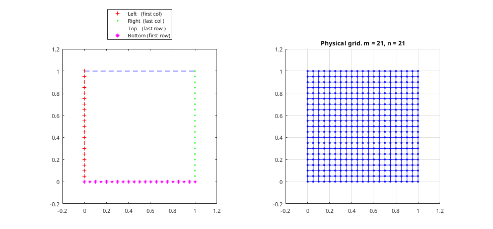
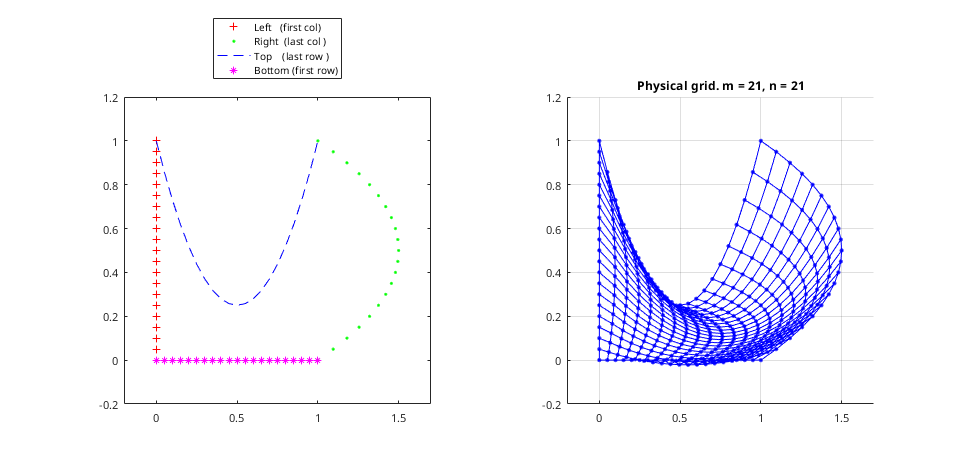
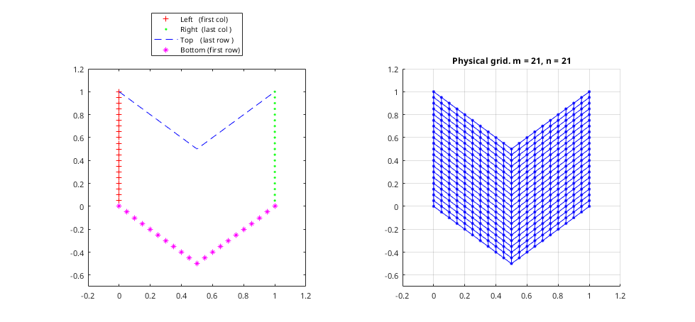
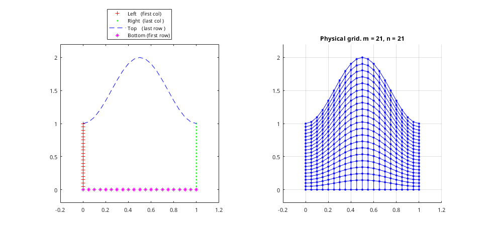
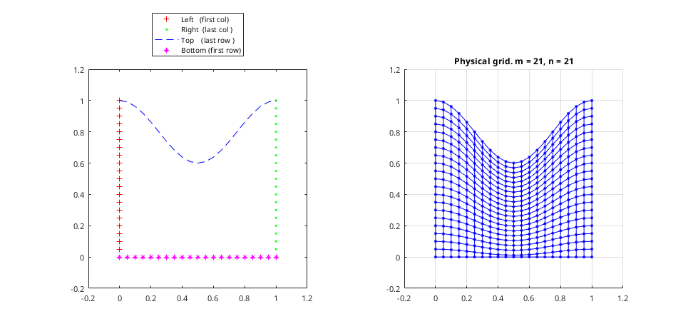
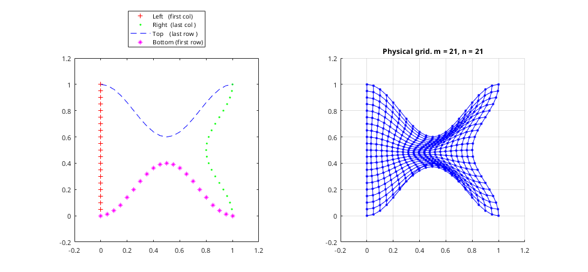
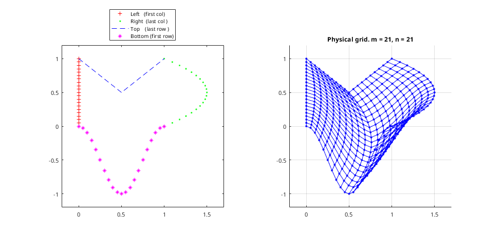

# Grid Maker

It contains code for [generating grids](MATLAB_Code/Grid_Generator.m) from the "Fundamentals of Grid Generation" book by Patrick Knupp and Stanly Steinberg.

Most of the grids from the book's appendix can be generated based on boundaries. A transfinite interpolator is included to show when interpolation works and doesn't work.

Some examples from the book using 21x21 points on a unit domain:

Square Grid

C.5 Swan Grid

C.6 Chevron

C.8 Dome Grid

C.9 Valley Grids

Fishtail

Mixed

